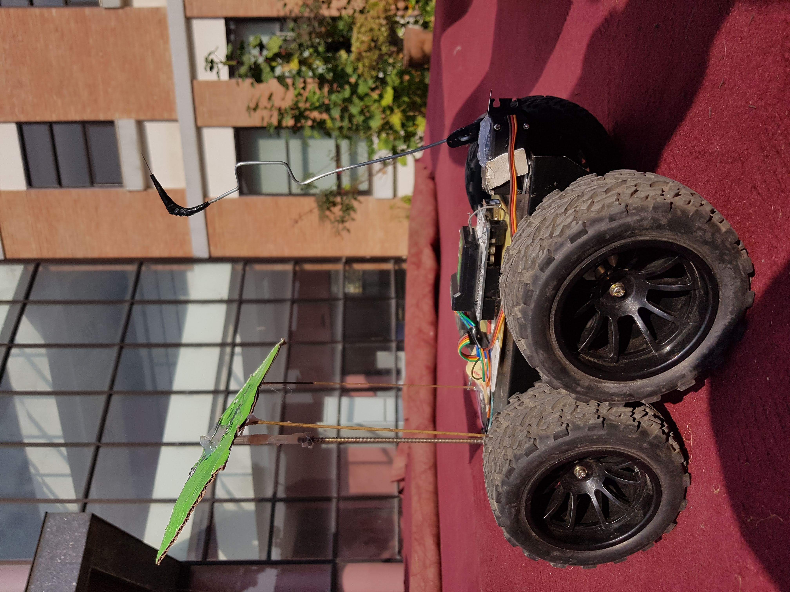
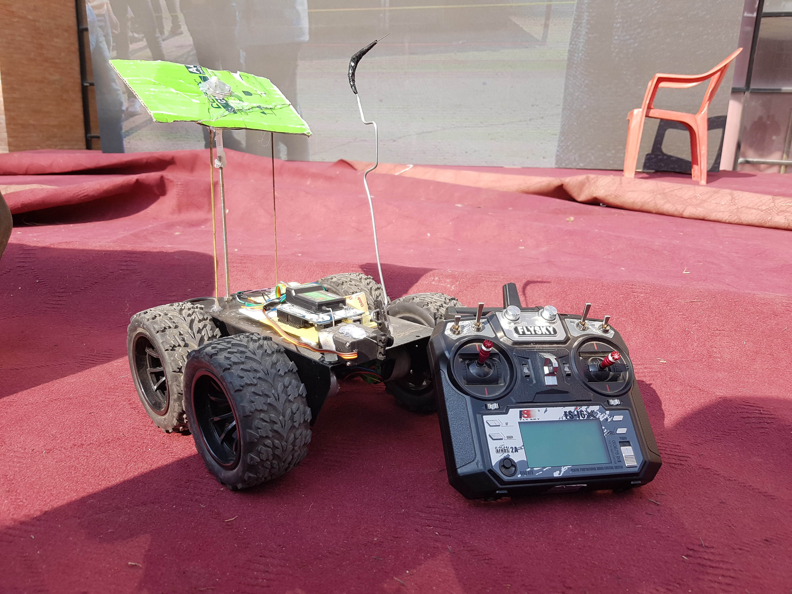

# RC-Car

RC-Car is an Arduino-based Remote Controlled car with Servo arm, developed for two events Vector organized by Western Region Campus (WRC) and Locus organized by Pulchowk Engineering Campus.

## Images

   

 

   

## Components Used

1. Arduino Uno
1. Bot Chassis
1. Geared Motor *4
1. Lipo Battery
1. Servo
1. Transmitter FLYSKY
1. Receiver FS-IA10B

## Working

The communication between bot and transmitter is done in Pulse Position Modulation (PPM) mode. **PPMReader.cpp**, **InterruptHandler.h**, **WInterrupts.cpp** and **PPMReader.h** files are used to convert the raw ppm signals to control information. In **wrapper.h**, functions used for the bot control are described and these functions are implemented in **RC-Car.ino**.

## Watch The Video

  

